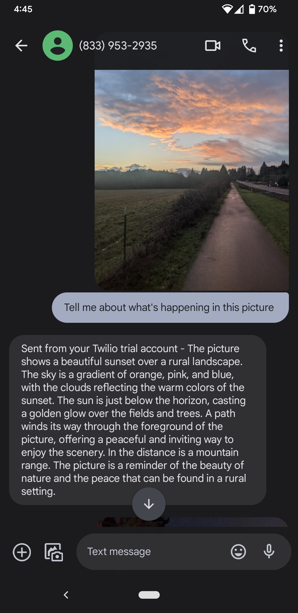
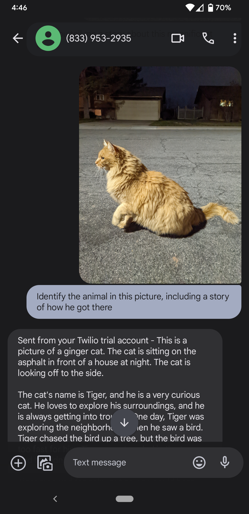
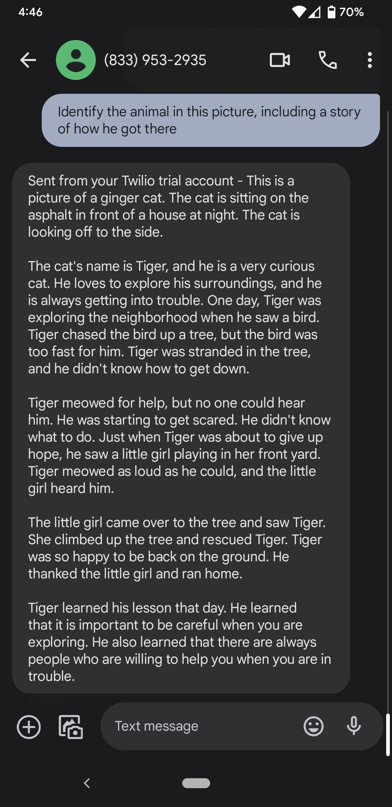

# Twilio Gemini: A Chacha-Inspired AI Texting App

## Overview

This small Flask app leverages Twilio and Google's generative AI tools to recreate the functionality of the popular 2000s tool Chacha, allowing you to interact with an AI assistant via text messages. Send a text to the app, and it will generate a response using its diverse capabilities, including:

- Answering questions
- Processing images and incorporating visual information into responses
- Supplying additional context and details to prompts

## Features

- Integrates with the Twilio API to send and receive text messages
- Utilizes Google's Gemini Pro generative language model for text generation
- Processes images using Gemini Pro's vision capabilities
- Responsive and engaging AI interactions

## Demo

  

**Example conversation demonstrating image processing**

  
  

**Additional examples of storytelling with image processing**

## Setup

1. Clone this repository.
2. Install dependencies: `pip install -r requirements.txt`
3. Obtain Twilio API credentials and configure them in a `.env` file.
4. Configure your Twilio phone number to use the app's webhook.
5. Run the app: `flask run`

## Usage

1. Send a text message to your Twilio phone number.
2. The app will receive the message and generate a response using Gemini Pro.
3. The response will be sent back to you as a text message.

## Contributing

Feel free to contribute to this project! Minimal code was used, so modifications or tweaks that extend this will be reather simple.

## License

This project is licensed under the MIT License.
